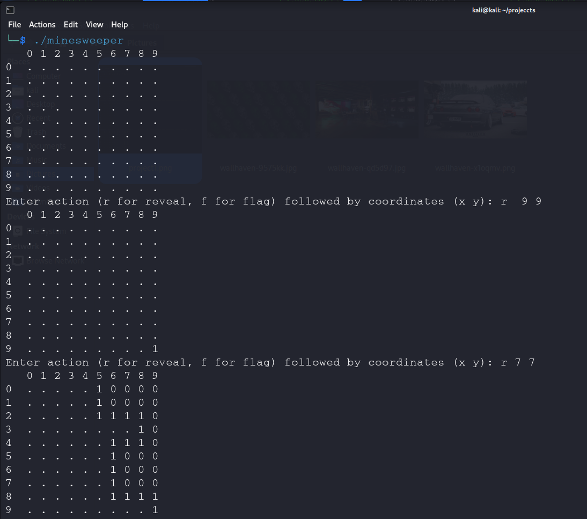
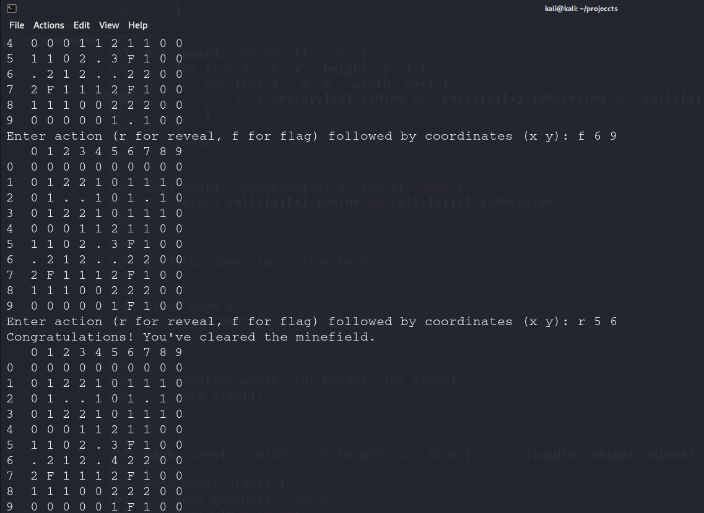

Minesweeper on Console 🕹️
===============



This is a simple minesweeper game that runs directly in the terminal. The project is implemented in C++.
The program is tested on Windows 11 and Linux.

**Rules are every number indicated the mines around it's boxes maximum 5.**
**Dont reveal the mine in which case you loose.**

Features
--------
1. **Gameplay**
- Enter r for reveal and f for flag. then define the cell's coordinates x y and hit enter.
- After that board is re printed and the reveal mine or number or 0.
- If all the mines are flaged you will win the game.
- If you step on a mine, You will loose.

2. **UI**
- A coordinated board is displayed.
- After that a prompt is Displayed to enter values of the move.

3. **Other things i want to add**
- I am going to add a Main menu: New game, Quit.
- Also wanna add player name and leaderboard which can be shown in menu.
- Auto-save Highscore of a returning player.
- Options to save and resume game (with continued timer).
- Timer only starts after first move.
- Auto re-render UI if detecting terminal resize.

- Compile and Run
---------------
You can comile with g++ in source folder on UNIX.
```bash
g++ -o minesweeper main.cpp Game.cpp Board.cpp Cell.cpp
./minesweeper
```
For windows you can install MINGW
and run
```bash
g++ -o minesweeper.exe main.cpp Game.cpp Board.cpp Cell.cpp
```
double click and run minesweeper

Gameplay
--------

Game screen:


Lose screen:


Win screen:

